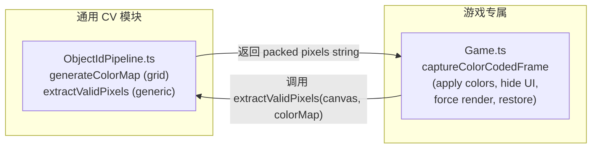

# Grid Color Code CV Plan

## 架构目标




Game.ts 只负责"怎么让画面变成 ID 模式"，`ObjectIdPipeline.ts` 负责"怎么从 canvas 提取干净像素"。

## 参数选定

- 格点值：`[40, 74, 108, 142, 176, 210]`（6值，step=34）
- `SNAP_TOL = 6`（保护截止 alpha=17.6%，污染区间 [0.2,0.8] 零漏过）
- `MAX_DIST_SQ = 20 * 20`（从 35² 收紧到 20²，step=34 时合理）
- 可用颜色：216，满足游戏 129 ID 需求

## 改动文件

### 1. `[ObjectIdPipeline.ts](packages/ballsort/src/game/render/ObjectIdPipeline.ts)`

**a) 导出格点常量**

```typescript
export const COLOR_GRID_VALS  = [40, 74, 108, 142, 176, 210];
export const COLOR_GRID_STEP  = 34;
export const COLOR_GRID_TOL   = 6;   // per-channel snap tolerance
```

**b) 修改 `generateColorMap`**

不再随机采样，改为从 6³=216 格点组合中按序分配，遇到 near-white `(r>215 && g>215 && b>215)` 则跳过：

```typescript
// build ordered list of all valid grid colors, then assign by index
const gridColors = COLOR_GRID_VALS.flatMap(r =>
    COLOR_GRID_VALS.flatMap(g =>
        COLOR_GRID_VALS.map(b => [r, g, b] as [number,number,number])
    )
).filter(([r,g,b]) => !(r > 215 && g > 215 && b > 215));
```

**c) 新增通用函数 `extractValidPixels`**

将 Game.ts 中的像素提取循环完整迁移到这里：

```typescript
export function extractValidPixels(
    canvas: HTMLCanvasElement,
    colorMap: ColorMap,
    downsample = 4,
): string {
    // 1. downsample with nearest-neighbor (imageSmoothingEnabled=false)
    // 2. iterate pixels: skip alpha < 200
    // 3. find nearest colorMap color (Euclidean)
    // 4. reject if dist > MAX_DIST_SQ  (20²)
    // 5. reject if any channel |pixel_ch - snapped_ch| > COLOR_GRID_TOL  ← NEW
    // 6. pack as 7-byte binary, return btoa string
}
```

签名完全通用——只需要一个 `HTMLCanvasElement` 和 `ColorMap`，无 Phaser 依赖。

### 2. `[Game.ts](packages/ballsort/src/game/scenes/Game.ts)`

`captureColorCodedFrame()` 中，将现有的像素循环部分（约 40 行）替换为一行调用：

```typescript
// 替换 lines 515-592 的 downsample + pixel loop + pack 逻辑
const pixels = extractValidPixels(this.game.canvas, colorMap);
```

其余游戏专属逻辑（apply 颜色、隐藏 UI、强制渲染、恢复）保持不变。