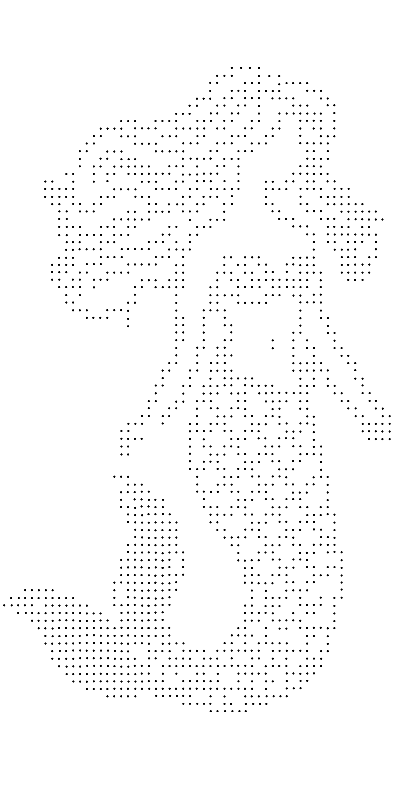

# 4. 资源清单

## 4.1 当前使用的资源
1. 界面元素
   -  
   - 
   - 
   - 
   - 
   - 
   - 
   - 
   - 
   - .png)
   

## 4.2 音效资源
当前使用的音效：
   - <audio controls src="../../物料-leah/音频/点击 短嗖.mp3" title="手指点击"></audio>
   - <audio controls src="../../物料-leah/音频/海边海鸥叫环境音.mp3" title="海鸥"></audio>
   - <audio controls src="../../物料-leah/音频/箭头成功音效.mp3" title="成功"></audio>
   - <audio controls src="../../物料-leah/音频/箭头失败音效.mp3" title="失败"></audio>
   - <audio controls src="../../物料-leah/音频/尤克里里弹奏-海滩Ukulele_Beac_爱给网_aigei_com.mp3" title="海滩"></audio>

## 4.3 需要替换/新增的资源
根据新需求需要更新的资源：
1. 界面元素
   -  
   - 
   - 
   - 
   - 
   - 
   - 
   - 
   - 
   - .png)

## 4.2 音效资源
当前使用的音效：
   - <audio controls src="../../物料-leah/音频/点击 短嗖.mp3" title="手指点击"></audio>
   - <audio controls src="../../物料-leah/音频/海边海鸥叫环境音.mp3" title="海鸥"></audio>
   - <audio controls src="../../物料-leah/音频/箭头成功音效.mp3" title="成功"></audio>
   - <audio controls src="../../物料-leah/音频/箭头失败音效.mp3" title="失败"></audio>
   - <audio controls src="../../物料-leah/音频/尤克里里弹奏-海滩Ukulele_Beac_爱给网_aigei_com.mp3" title="海滩"></audio>