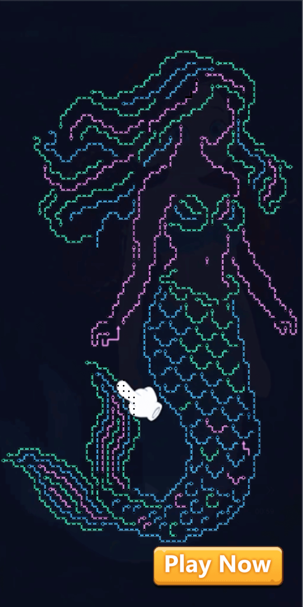
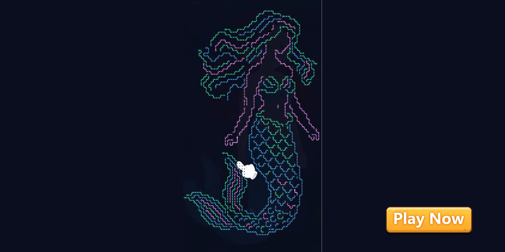

# 1. 项目概述
当前项目是一个基于 Phaser 3 + TypeScript 开发的 Arrow2 箭头消除玩法游戏。玩家需要在限定操作次数内，通过点击或拖拽的方式，将方向或类型一致的箭头进行连接与消除，完成关卡目标。

# 2. 技术架构
- 游戏引擎：Phaser 3
- 开发语言：TypeScript
- 构建工具：Vite
- 项目结构：
  ```
  src/
  ├── game/
  │   ├── scenes/         # 游戏场景
  │   ├── components/     # 游戏组件
  │   └── EventBus.ts     # 事件系统
  ├── assets/            # 资源文件
  └── config/           # 配置文件


# 3. 场景设计

## 3.1 游戏场景尺寸
- 竖屏模式：1080 x 2160 像素
- 横屏模式：2160 x 1080 像素
- 缩放策略：保持宽高比，自适应屏幕

## 3.2 UI组件布局与尺寸

### 竖屏布局 (1080 x 2160)
1. 游戏区域（美人鱼区域）
   - 位置：
     * x = (1080 - 总宽度) / 2， y = (2160 - 总高度) / 2
     * w = 1050px， h = 1749px
  

2. 下载按钮
   - 位置：
     * x = 8px, y = 1050px
     * w = 1050px, h = 1749px

3.像素点
     * x = 787px, y = 45px
     * w = 578px, h = 962px

3. 排版参考
   - 参考图：
     * 


### 横屏布局 (2160 x 1080)
1. 游戏区域（美人鱼区域）
   - 位置：
     * x = (1080 - 总宽度) / 2， y = (2160 - 总高度) / 2
     * w = 596px， h = 1080px
2.像素点
     * x = 787px, y = 45px
     * w = 578px, h = 962px

3. 下载按钮
   - 位置：
     * x = 1650px, y = 885px
     * w = 373px, h = 123px

4. 连线表现层
   - 位于箭头元素上方
   - 显示玩家拖拽时形成的连线路径
   - 路径点依次连接箭头中心点
   - 连线不会超出棋盘区域显示


1. 排版参考
   - 参考图：
    * 

  
# 4. 资源清单

## 4.1 当前使用的资源
1. 界面元素
   -  
   - 
   - 
   - 
   - 
   - 
   - 
   - 
   - 
   - .png)
   

## 4.2 音效资源
当前使用的音效：
   - <audio controls src="../../物料-leah/音频/点击 短嗖.mp3" title="手指点击"></audio>
   - <audio controls src="../../物料-leah/音频/海边海鸥叫环境音.mp3" title="海鸥"></audio>
   - <audio controls src="../../物料-leah/音频/箭头成功音效.mp3" title="成功"></audio>
   - <audio controls src="../../物料-leah/音频/箭头失败音效.mp3" title="失败"></audio>
   - <audio controls src="../../物料-leah/音频/尤克里里弹奏-海滩Ukulele_Beac_爱给网_aigei_com.mp3" title="海滩"></audio>

## 4.3 需要替换/新增的资源
根据新需求需要更新的资源：
1. 界面元素
   -  
   - 
   - 
   - 
   - 
   - 
   - 
   - 
   - 
   - .png)

## 4.2 音效资源
当前使用的音效：
   - <audio controls src="../../物料-leah/音频/点击 短嗖.mp3" title="手指点击"></audio>
   - <audio controls src="../../物料-leah/音频/海边海鸥叫环境音.mp3" title="海鸥"></audio>
   - <audio controls src="../../物料-leah/音频/箭头成功音效.mp3" title="成功"></audio>
   - <audio controls src="../../物料-leah/音频/箭头失败音效.mp3" title="失败"></audio>
   - <audio controls src="../../物料-leah/音频/尤克里里弹奏-海滩Ukulele_Beac_爱给网_aigei_com.mp3" title="海滩"></audio>
  
# 5. 游戏逻辑

## 5.1 核心玩法
- 当前配置：
  * 棋盘内容：由大量箭头路径拼成的图案关卡
  * 箭头总量：按关卡图案生成
  * 单格承载：每个格子固定1个箭头路径
  * 倒计时时间：无
  * 胜利条件：完成指定次数的有效路径飞出或当图案逐渐消失达到指定比例
  * 连线消除规则：玩家点击起点箭头，当箭头所指的方向无任何遮挡时形成一条路径随即飞出画面，路径只能经过上下左右相邻的箭头格（不包含斜向）

- 交互反馈：
  * 点击非棋盘区域：判定为无效操作，不触发反馈
  * 正确起手：起点箭头高亮（描边发光）并轻微放大
  * 连线过程：手指点击箭头，同时生成一条实时延展的连线路径
  * 正确结算：路径上的箭头按所指的方向依次飞出画面并伴随轻微棋盘震动增强爽感
  * 错误结算：当箭头所指的方向有遮挡时，路径不能快速飞出画面，所有已点亮箭头取消高亮并恢复原状（可带一次轻微抖动提示失败但不惩罚）

## 5.2 引导系统
- 初始引导：
  * 显示位置：棋盘中任意一组当前可直接飞出画面的箭头起点路径
  * 动画表现：手指图标在起始箭头上方循环缩放（约+20%），同时在起始箭头与相邻箭头之间显示一段半透明连线飞出画面的预览，连线预览方向与正确操作路径保持一致
  * 触发条件：游戏开始时自动触发或首次进入试玩必定出现

- 游戏中引导：
  * 显示位置：任意箭头所指方向无其他遮挡的合法的箭头路径
  * 动画表现：手指从起始箭头滑动至第二个箭头，同步显示短距离连线路径动画，暗示“可以从这儿点击飞出”
  * 触发条件：玩家连续5秒无任何有效操作
  * 消失条件：任意一次正确的箭头路径飞出后立即消失，若玩家开始操作但未成功消除，引导不立即再次出现

## 5.3 跳转系统
- 跳转逻辑：
1. 根据有效路径飞出次数跳转（需可配置）
2. 根据图案完成进度跳转（需可配置，例如完成轮廓/关键区域达到阈值）
3. 弹框弹出3秒无操作自动跳转（需可配置，弹框出现后点击按钮可立即跳转）

## 5.4 自适应布局系统
- 监听事件：window.resize
- 处理逻辑：
  1. 检测屏幕方向
  2. 更新游戏场景尺寸
  3. 重新计算所有UI元素位置
  4. 重新计算差异点位置和大小

## 5.5 性能考虑
- 当前资源尺寸：未优化
- 动画实现：使用Phaser.Tweens
- 事件系统：使用自定义EventBus
- 内存管理：
  * 正确销毁临时对象（如动画特效）
  * 适当缓存频繁使用的对象

# 6. 详细实现规范

## 6.1 动画系统参数

1. 入场动画
- 透明度：从完全透明渐变到完全不透明
- 缩放：从原始尺寸的 1.15 倍缩小到原始尺寸
 - 持续时间：500毫秒
 - 缓动效果：带有弹性的缓出效果
 - 序列延迟：
  * 标题：立即显示
  * 游戏画面（棋盘底板+箭头图案）：延迟150毫秒后显示
  * 引导手指：延迟300毫秒后显示（需先确保棋盘可交互区域已就绪）
  * 下载按钮：延迟400毫秒后显示

1. 正确点击
- 路径形成效果：
  * 起点点击后：起点箭头高亮并轻微放大（缩放100%→112%，120ms）
  * 路径预览线：从起点开始生成，沿箭头所指方向推演式延展（每经过一格延迟 35ms点亮一次）
  * 点亮节奏：路径上的箭头依次点亮（亮度0→1→0.8，160ms），形成可飞出的明确预告
- 飞出动画：
  * 触发时机：当箭头所指方向无任何遮挡，且路径满足可飞出条件
  * 飞出方式：路径上的箭头按顺序沿各自方向快速飞出画面（不是原地淡出）
  * 速度曲线：先快后更快（加速感明显），飞出总时长建议450–650ms内完成
- 飞出后的收尾：
  * 棋盘轻微震动：幅度6px、2次回弹，200ms
  * 路径线条：在第一个箭头飞出时开始淡出，整体120ms内消失
  * 成功音效：触发一次短促清脆音效；若连续成功，音高可轻微上扬（每次+3%）
  * 使用平滑的加速插值曲线，避免“突然瞬移”造成不真实感

1. 错误点击动画
- 触发条件：玩家点击起点后，检测到箭头所指方向存在遮挡（例如前方是不可通行箭头块）
 - 动画表现：
  * 路径无法形成飞出：预览线延展到遮挡处立即停止
  * 遮挡提示：遮挡格或阻挡物轻微闪烁/抖动一次（左右4px，150ms）
  * 起点箭头短暂停顿：高亮保持150ms后取消
  * 取消回退：所有已点亮箭头在120ms内统一降亮并恢复原状
  * 不播放强惩罚动画（不黑屏、不强烈红闪），避免挫败感
- 若错误点击伴随重新选择：
  * 新起点箭头可立即进入高亮态，不需等待上一段动画结束（但需保证路径线已清空）

1. 引导手指动画
- 手指图标缩放：
  * 缩放范围：100%–120%
  * 无限循环播放（周期约800ms）
- 引导辅助表现：
  * 在手指所在起点箭头上方
  * 显示半透明路径预览线，并明确表现飞出方向（可在预览线末端带一个小箭头或渐隐尾迹）
  * 预览线长度建议2–4格，避免演示过长导致注意力分散
- 显示和消失：
  * 渐变显示（200ms）
  * 任意一次正确路径飞出完成后渐变消失（150ms）
  * 若玩家开始操作但失败，不立即再次出现，避免打断尝试节奏

1. 图案完成进度动画（局部完成/阶段完成表现）
- 完成高亮：
  * 当图案完成进度达到关键阈值（如50%/80%/100%），棋盘整体扫光一次（左→右或上→下）
  * 扫光持续时间：600ms
- 局部完成表现：
  * 被清除区域边缘出现一次柔和发光轮廓（350ms衰减）
  * 若存在关键区域完成概念，可在该区域中心弹出小型完成标记（缩放 1.2 → 1.0，220ms）
- 动画期间：不阻塞继续点击（除非同时触发跳转弹窗），保持可玩广告节奏不断档

## 6.2 事件系统

游戏中的核心事件包括：

1. 正确点击事件（路径飞出事件）
- 触发条件：玩家点击起点箭头，且箭头所指方向无任何遮挡，满足可飞出规则
- 传递信息：
  * 起点坐标
  * 飞出路径长度
  * 飞出路径序列（格子列表）
  * 当前图案完成进度（飞出前/后）
- 处理流程：
  * 播放路径预览与点亮动画
  * 播放箭头依次飞出画面动画
  * 更新棋盘数据（对应格子置空/状态变更）
  * 更新完成进度与计次（有效飞出次数、累计清除量）
  * 检查是否触发弹窗跳转或胜利条件

2. 点击失误事件（遮挡失败事件）
- 触发条件：玩家点击起点箭头，但箭头所指方向存在遮挡导致不可飞出
- 传递信息：
  * 起点坐标
  * 遮挡位置坐标/类型（若有）
- 处理流程：
  * 播放路径停止 + 遮挡抖动 + 取消高亮反馈
  * 清空路径预览线与临时高亮
  * 保持棋盘数据不变（不计入有效次数）

3. 无效点击事件
- 触发条件：玩家点击非棋盘区域
- 传递信息：点击坐标
- 处理流程：
  * 判定为无效操作，不触发任何反馈（或极轻微不影响注意力的提示）
  * 不更新计次与进度

4. 游戏结束/跳转事件
- 触发条件：
  * 有效路径飞出次数达到设定阈值
  * 图案完成进度达到设定阈值
  * 弹框弹出后3秒无操作自动跳转
- 处理流程：
  * 停止棋盘交互（锁输入）
  * 弹出跳转提示或直接跳转
  * 触发落地页/商店跳转

5. 游戏胜利事件
- 触发条件：达到胜利条件（有效飞出次数达标或进度达标）
- 处理流程：
  * 播放阶段完成/整体完成动画（扫光+发光轮廓）
  * 弹出胜利弹框
  * 点击按钮跳转或3秒无操作自动跳转

## 6.3 状态管理

1. 游戏状态说明：
- 游戏开始标志
  * 用途：控制游戏是否进入可交互状态
  * 影响：引导显示、计次开始、是否允许点击起点
  * 变更时机：入场动画结束后置为可交互（或玩家首次点击后才置为开始，二选一）
- 输入锁定状态
  * 用途：防止飞出动画期间重复点击导致路径与数据错乱
  * 影响：锁定期间屏蔽所有点击/拖拽输入
  * 变更时机：飞出动画开始置 true，动画结束置 false
- 当前选择状态
  * 用途：记录当前起点箭头是否已选中
  * 影响：是否显示路径预览线、是否可进行下一步结算
  * 变更时机：点击起点后设置；结算或取消后清空
- 引导计时器
  * 用途：控制引导手指出现时机（5s无操作）
  * 影响：引导手指与半透明预览路径显示
  * 变更时机：玩家任意有效操作后重置，每秒递减
- 计次与进度
  * 用途：跳转与胜利判断
  * 影响：触发弹窗、强跳、胜利表现
  * 变更时机：每次正确飞出完成后更新
2. 状态转换流程：
- 游戏开始流程
1. 播放入场动画（标题→棋盘→CTA→引导）
2. 显示初始引导手指于任意可飞出路径的起点
3. 等待玩家点击起点箭头
4. 首次成功飞出后移除引导手指
5. 启动/重置引导检测计时器
6. 进入正常点击监听状态（允许连续多次飞出）
- 游戏进行流程
1. 玩家点击起点箭头
2. 检测遮挡：
  * 无遮挡 → 播放预览 → 路径飞出 → 更新进度/计次
  * 有遮挡 → 播放失败反馈 → 恢复原状
3. 重置引导计时器
4. 检查胜利/跳转条件
5. 若触发弹框/强跳则进入结束流程，否则继续游戏
- 结束检测流程
1. 持续检测：有效飞出次数阈值/完成进度阈值
2. 达到弹框条件：弹框出现并开始3秒无操作倒计时
3. 倒计时结束无操作：自动跳转
4. 点击弹框按钮：立即跳转

## 6.4 资源规格

1. 资源规范：

- 美人鱼
  * 文件格式：PNG
  * 图片尺寸：596 x 1080像素

- 界面元素
  * 引导手指：215 x 167像素，PNG格式
  * 下载按钮：373 x 123像素，PNG格式
  * 竖版背景：1080 x 2160像素，PNG格式
  * 横版背景：2160 x 1080像素，PNG格式

  


## 6.5 性能优化规范

1. 图片资源优化：

- 格式选择
  * UI元素使用PNG格式，支持透明度
  * PNG图片使用8位色深减小体积

- 加载策略
  * 游戏开始前预加载必要资源
  * 场景切换时加载对应资源
  * 使用加载进度条提示

2. 内存管理：

- 对象池管理
  * 适用对象：引导手指
  * 预创建数量：根据最大同时显示数量
  * 复用策略：使用完立即回收

- 资源释放
  * 及时销毁临时动画对象
  * 场景切换时清理旧场景
  * 定期检查未使用的资源

3. 事件管理：
- 及时解绑事件监听器
- 清理定时器和计时器
- 避免事件监听器累积

## 6.6 错误处理机制

1. 资源加载错误：
- 监测加载失败的资源
- 记录详细的错误信息
- 尝试使用备用资源
- 显示友好的错误提示

2. 游戏逻辑错误：
- 捕获并记录异常
- 保持游戏状态稳定
- 提供恢复机制
- 避免游戏卡死

## 6.7 调试功能

开发模式特性：
- 实时显示帧率
- 显示点击判定区域
- 输出详细日志
- 支持手动触发事件

## 6.8 点击判定机制

判定原理：
- 使用圆形判定区域
- 计算点击位置到中心点距离
- 考虑图片缩放比例
- 设置合理的判定范围

## 6.9 动画计算方法

动画实现原理：
- 使用线性插值计算过渡
- 应用不同的缓动函数
- 支持循环和往复动画
- 保证动画流畅性

# 7 Board组件实现

## 7.1 属性
```typescript
scene: Phaser.Scene;                                      // 持有的场景引用
root: Phaser.GameObjects.Container;                        // Board根容器（统一缩放/位移）

// === 背景与棋盘 ===
bgImage: Phaser.GameObjects.Image;                         // 游戏底图/背景
boardImage: Phaser.GameObjects.Image | null = null;        // 棋盘底板（若有）
boardRect: Phaser.Geom.Rectangle = new Phaser.Geom.Rectangle(); // 棋盘可交互区域（整体判定）

// === 格子与箭头 ===
gridRows: number = 6;                                      // 行数（可配）
gridCols: number = 6;                                      // 列数（可配）
cellSize: number = 120;                                    // 单元格尺寸（px，可配）
cellGap: number = 16;                                      // 单元间距（px，可配）
cellRects: Phaser.Geom.Rectangle[][] = [];                  // 每个格子的点击/命中矩形
cellCenters: Phaser.Math.Vector2[][] = [];                  // 每个格子的中心点坐标（用于连线/动效）

arrowSprites: Phaser.GameObjects.Image[][] = [];            // 每格箭头贴图对象
arrowDirData: number[][] = [];                              // 关卡数据：每格箭头方向（0/1/2/3 = 上右下左）
arrowState: ('Normal' | 'Selected' | 'Clearing' | 'Empty')[][] = []; // 每格状态

// === 连线与高亮 ===
pathLine: Phaser.GameObjects.Graphics;                      // 实时路径线（拖拽期间绘制）
pathPoints: Phaser.Math.Vector2[] = [];                     // 路径点（按顺序存中心点）
pathCells: { r: number; c: number }[] = [];                 // 路径格子序列（按顺序）
selectedSet: Set<string> = new Set();                       // 选中过的格子集合（防重复）
currentStart: { r: number; c: number } | null = null;       // 当前起点格
minClearLen: number = 3;                                    // 最小消除长度（可配）

// === 动画与输入控制 ===
isDragging: boolean = false;                                // 是否处于连线拖拽中
isAnimating: boolean = false;                               // 是否在播放消除/结算动画（防止多点）
dragPointerId: number | null = null;                        // 当前拖拽指针ID（防多指干扰）

// === 计数与引导 ===
hintTimer: number = 0;                                      // 引导计时器（5s无操作）
idleHintSeconds: number = 5;                                // 无操作触发引导阈值（可配）
clearCount: number = 0;                                     // 成功消除次数（跳转/结束用）
clearedArrowTotal: number = 0;                              // 累计消除箭头数（跳转/结束用）

// === 跳转/弹窗阈值（由外部配置注入也可）===
popupAtClearCount: number = 15;                             // 达到N次消除弹窗（可配）
jumpAtClearCount: number = 20;                              // 达到N次消除直接跳转（可配）可配）
```

## 7.2 箭头处理
- 创建
  * initializeBoard(rows: number, cols: number, levelData: number[][])：初始化棋盘数据（方向/空位）与可视对象
  * createBoardView()：创建棋盘底板、计算棋盘Rect、初始化绘制层
  * createCell(r: number, c: number)：创建单元格判定区域与中心点缓存
  * createArrow(r: number, c: number, dir: number)：创建箭头贴图并设置朝向（旋转角度）
  * rebuildCellArrow(r: number, c: number)：当该格数据变化（被清除/重置）时刷新显示
  * resetBoardVisual()：快速清空所有选中态、路径线、临时特效
- 箭头选中与路径扩展
  * startPath(r: number, c: number)：起手选择某格作为路径起点（高亮+初始化序列）
  * canExtendTo(r: number, c: number): boolean：检查是否可扩展到该格（相邻/不重复/规则）
  * extendPath(r: number, c: number)：加入路径（记录格子+点位+高亮+更新线条）
  * isAdjacent(a: {r:number,c:number}, b:{r:number,c:number}): boolean：相邻判定（仅上下左右）
  * isRepeated(r: number, c: number): boolean：重复选中判定
  * isDirectionValid(prev: {r:number,c:number}, next: {r:number,c:number}): boolean：方向/类型规则判定（按Arrow2规则）
  * highlightCell(r: number, c: number, on: boolean)：格子高亮（描边/发光/缩放）
- 路径线绘制（实时）
  * updatePathLine()：根据 pathPoints 重新绘制连线
  * clearPathLine()：清空路径线图形
  * addPathPoint(point: Phaser.Math.Vector2)：增加路径点并刷新绘制
- 结算（松手消除）
  * endPathAndResolve()：松手入口，决定成功/失败
  * canClearCurrentPath(): boolean：是否满足最小长度与规则
  * clearArrows(path: {r:number,c:number}[])：执行消除流程（数据更新 + 动画队列）
  * animateClearSequence(path: {r:number,c:number}[])：连锁消除动画（按顺序、短间隔）
  * applyClearResult(path: {r:number,c:number}[])：动画结束后落地到数据（置空/刷新显示）
  * playClearFX(r: number, c: number, dir: number)：单格消除特效（碎片/闪光）
  * playBoardShake()：消除结束棋盘轻震动（增强爽感）
- 无效结算（错误/不足）
  * cancelPath()：取消当前路径（清理线条+取消高亮）playInvalidFeedback()：无效反馈（路径闪一下→淡出、最后一格轻抖动）
- 完成检测与跳转检查
  * checkWinCondition(): boolean：检查是否满足胜利条件（达到目标消除次数/清除量）
  * checkJumpCondition(): {popup?: boolean, jump?: boolean}：检查是否达到弹窗/强跳阈值
  * lockInteraction()：结算/弹窗期间锁定输入
  * unlockInteraction()：结算完成恢复输入

## 7.3 用户交互
- 点击/拖拽判定
  * onPointerDown(pointer: Phaser.Input.Pointer)：统一按下入口（起手选中）
  * onPointerMove(pointer: Phaser.Input.Pointer)：拖拽过程中扩展路径（命中格子变化才处理）
  * onPointerUp(pointer: Phaser.Input.Pointer)：松手结算入口
  * getCellByPoint(x: number, y: number): {r:number,c:number} | null：根据坐标命中棋盘格
  * isInBoardArea(x: number, y: number): boolean：是否在棋盘可交互区域内
  * isClickValidArea(x: number, y: number): boolean：非棋盘区域点击判定（无效不反馈或极轻反馈）
- 交互流程
  * 无路径时：按下某箭头格 → startPath（高亮起点+显示路径头）
  * 拖拽过程中：
手指移动到相邻格 → 若 canExtendTo 为 true：extendPath
若不合法：不加入路径（可选播放轻微提示，不中断拖拽）
  * 松手结算：
    1. 若 canClearCurrentPath = true：连锁消除 → 更新计数 → 检查胜利/跳转
    2. 若 canClearCurrentPath = false：无效反馈 → 清空路径 → 保持棋盘不变
- 引导事件
  * getHintPath(): {cells: {r:number,c:number}[]} | null：提供一段可执行的最短提示路径（至少2格，优先可形成3格以上）
  * showHint(cells: {r:number,c:number}[])：展示引导（手指缩放循环 + 半透明路径预览）
  * resetHintTimer()：任意按下或成功消除后重置 5s 计时
  * hideHint()：任意一次成功消除后渐隐消失
- 事件派发（与事件系统对接）
  * emitActionEvent(type: 'Start' | 'Extend' | 'Clear' | 'Invalid' | 'Popup' | 'Jump' | 'Win', payload?: any)
  * 触发时机：起手选中、路径扩展、成功消除、无效松手、弹窗出现、强跳、胜利等

## 7.4 自适应处理
- 监听resize事件
- 重新计算裁剪区域
- 更新差异点位置和判定区域
- 保持图片比例不变
- 保持10px透明区域