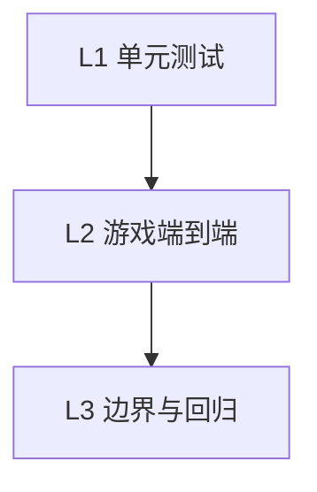

# CV Detection 测试计划

## 目标

验证颜色编码检测（color_cv_processor）在游戏帧中能正确识别 tubes 和 balls，为 CV → Game 提供可靠基础。

**检测方式**：游戏发送 `pixelData` + `colorMap`，服务端通过颜色聚类匹配 object ID。

---

## 测试层级



---

## L1: 单元测试（可选）

可为 `color_cv_processor.py` 的 `process_pixel_data`、`process_color_coded_frame` 编写 pytest 用例，验证颜色匹配与 object 解析逻辑。

---

## L2: 游戏端到端（手动）

### 2.1 环境准备

```bash
cd packages/ballsort
npm run dev:cv
```

- 游戏：http://localhost:8080?level=1&cv=1
- CV UI：http://localhost:5000

### 2.2 测试步骤

| 步骤 | 操作 | 预期 |
|-----|------|------|
| 1 | 打开游戏，等待加载 | 显示 "CV: Paused - Press S to step" |
| 2 | 按 **S** 发送一帧 | 游戏短暂暂停后恢复，发送 color-coded 像素数据 |
| 3 | 打开 CV UI (http://localhost:5000) | 显示最新帧 |
| 4 | 检查 Detections 面板 | `objects` 非空，含 tubes 和 balls 的 id |
| 5 | 检查 Stats | `processingMs` 合理（< 500ms） |
| 6 | 检查 overlay | 标注检测到的对象 |

### 2.3 验证 detections 与游戏状态一致

| 场景 | 操作 | 验证 |
|-----|------|------|
| 简单布局 | level=1，2 试管 | `objects` 含 tube id 和 ball id |
| 移动球 | 拖一球到另一试管，再按 S | 对应 ball 的 `tubeId` 或位置变化 |
| 多球 | 选 level 多球 | 检测到的 id 与 100+tubeId*10+slot 一致 |

---

## L3: 边界与回归测试

| 用例 | 操作 | 预期 |
|-----|------|------|
| 无效数据 | 发送缺少 colorMap 的消息 | `status: error` 或合理降级 |
| 小分辨率 | 游戏窗口缩小 | 检测成功或部分成功 |
| 大分辨率 | 游戏全屏 1080x2160 | 检测成功，processingMs 合理 |

---

## 常见问题

| 现象 | 可能原因 | 处理 |
|-----|----------|------|
| objects 为空 | colorMap 未正确传递 | 检查 Game.ts captureColorCodedFrame |
| objects 为空 | 未重启 dev:cv | 修改 color_cv_processor 后需重启 |
| CV UI 无帧 | WebSocket 未连接 | 确认 CV server 已启动，刷新 CV UI |
| CV UI 黑屏 | 见「排查计划」 | 按顺序执行排查 |
