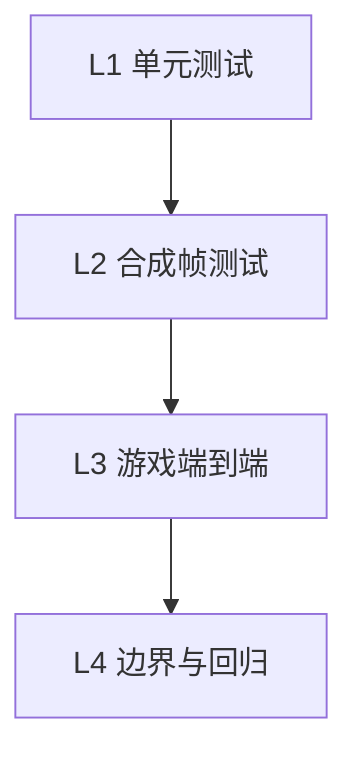
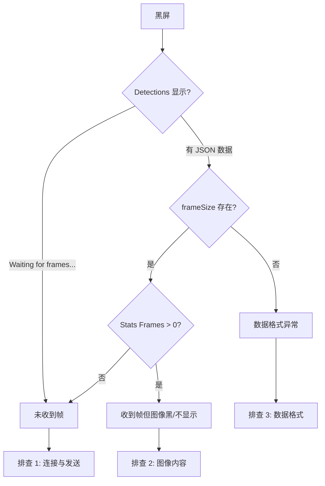

# CV Detection 测试计划

## 目标

验证 ArUco 检测在游戏帧中能正确识别 tubes 和 balls，为 Phase 4 (CV → Game) 提供可靠基础。

---

## 测试层级



---

## L1: 单元测试（自动化）

**命令**：`cd packages/ballsort && cv-bridge/venv/bin/python -m pytest cv-bridge/test_cv_processor.py -v`

| 用例 | 输入 | 预期 |
|-----|------|------|
| 合成图含 tube 0 | PNG base64 | `tubes` 含 id=0 |
| 合成图含 ball 100,110 | PNG base64 | `balls` 含对应 id |
| 无效 base64 | 非法字符串 | `status: error` |
| 无 ArUco 白图 | 10x10 白图 | `tubes/balls` 空，`status: ok` |
| data URL 格式 | `data:image/png;base64,...` | 正常解析 |
| 无效图像数据 | 非图像 base64 | `status: error` 或空 |

**通过标准**：6 个用例全部 PASS

---

## L2: 合成帧 WebSocket 测试（自动化）

**前置**：`npm run dev:cv` 已启动

**命令**：`cv-bridge/venv/bin/python cv-bridge/e2e_test_send.py`

| 检查项 | 预期 |
|--------|------|
| 连接 ws://localhost:8765 | 成功 |
| 发送含 ArUco 的 base64 帧 | 成功 |
| 响应 `status` | `ok` |
| 响应 `detections.tubes` | 非空（含 id=0） |
| 响应 `detections.processingMs` | < 500ms |

---

## L3: 游戏端到端（手动）

### 3.1 环境准备

```bash
cd packages/ballsort
npm run generate:aruco   # 若未生成则执行
npm run dev:cv
```

- 游戏：http://localhost:8080?level=1&cv=1
- CV UI：http://localhost:5000

### 3.2 测试步骤

| 步骤 | 操作 | 预期 |
|-----|------|------|
| 1 | 打开游戏，等待加载 | 显示 "CV: Paused - Press S to step" |
| 2 | 按 **C** 进入 CV 模式 | 试管、球变为黑白 ArUco 方块 |
| 3 | 按 **S** 发送一帧 | 游戏短暂暂停后恢复 |
| 4 | 打开 CV UI (http://localhost:5000) | 显示最新帧 |
| 5 | 检查 Detections 面板 | `tubes` 非空，至少含 0–13 中部分 id |
| 6 | 检查 Detections 面板 | `balls` 非空（若有球） |
| 7 | 检查 Stats | `processingMs` 合理（< 500ms） |
| 8 | 检查 overlay | 绿色框标 tubes，橙色框标 balls |

### 3.3 验证 detections 与游戏状态一致

| 场景 | 操作 | 验证 |
|-----|------|------|
| 简单布局 | level=1，2 试管 | `tubes` 含 2 个 id，`balls` 数量与球数一致 |
| 移动球 | 拖一球到另一试管，再按 S | `balls` 中对应 id 的 `tubeId` 变化 |
| 多球 | 选 level 多球 | 检测到的 ball id 与 100+tubeId*10+slot 一致 |

### 3.4 回归：非 CV 模式

| 步骤 | 操作 | 预期 |
|-----|------|------|
| 1 | 按 **C** 切回正常模式 | 画面恢复彩色 |
| 2 | 按 **S** 发送一帧 | 游戏发送帧 |
| 3 | 检查 CV UI detections | `tubes`、`balls` 为空（无 ArUco） |

---

## L4: 边界与回归测试

| 用例 | 操作 | 预期 |
|-----|------|------|
| 无 OpenCV 环境 | `pip uninstall opencv-contrib-python` 后运行 | `status: ok`，`tubes/balls` 空，不抛异常 |
| 无效 base64 | 发送 `{"frame":"xxx"}` | `status: error`，含 `error` 字段 |
| 小分辨率 | 游戏窗口缩小 | 若仍显示 ArUco，检测应成功或至少部分成功 |
| 大分辨率 | 游戏全屏 1080x2160 | 检测成功，processingMs 合理 |

---

## 检查清单

| 层级 | 通过标准 |
|-----|----------|
| L1 | `pytest cv-bridge/test_cv_processor.py` 全绿 |
| L2 | `e2e_test_send.py` 输出 "E2E OK" |
| L3 | 游戏按 S 后 CV UI 显示非空 tubes/balls |
| L4 | 边界用例行为符合预期 |

---

## 排查计划：CV UI 显示黑屏

当 CV UI 左侧帧区域显示一大块黑色时，按以下顺序排查。

### 排查流程图



### 排查 1：未收到帧（Detections 为 "Waiting for frames..."）

| 步骤 | 检查 | 处理 |
|-----|------|------|
| 1.1 | CV UI 显示 **Connected**？ | 若 Disconnected，确认 `npm run dev:cv` 已启动，刷新 CV UI |
| 1.2 | 游戏 URL 含 `?cv=1`？ | 必须 `http://localhost:8080?level=1&cv=1` |
| 1.3 | 游戏已加载？ | 等待 "CV: Paused - Press S to step" 出现 |
| 1.4 | 是否按了 **S**？ | 按 S 才会发送帧 |
| 1.5 | 顺序是否正确？ | 先打开 CV UI 再按 S，或先按 S 再打开 CV UI 均可；CV UI 需在连接状态下才能收到后续广播 |
| 1.6 | 游戏与 CV UI 是否同标签页？ | 建议两个标签页：一个游戏，一个 CV UI；在游戏标签按 S |

### 排查 2：收到帧但图像黑/不显示（Detections 有 JSON，Stats 有 Frames）

| 步骤 | 检查 | 处理 |
|-----|------|------|
| 2.1 | `frameSize` 是否合理？ | 如 1080x2160 正常；若为 0 或异常则可能解码失败 |
| 2.2 | 游戏画布是否黑？ | 若游戏在 iframe 或 simulator 中，确认 canvas 有内容；尝试在游戏主窗口按 S |
| 2.3 | 是否在首帧前就发送？ | 等游戏完全渲染后再按 S |
| 2.4 | 浏览器控制台 | F12 → Console，看是否有 img onerror、CORS 等报错 |
| 2.5 | base64 格式 | 确认 broadcast 的 frame 含 `data:image/jpeg;base64,` 前缀或完整 base64 |

### 排查 3：数据格式异常

| 步骤 | 检查 | 处理 |
|-----|------|------|
| 3.1 | Detections JSON 结构 | 应有 `tubes`、`balls`、`frameSize`、`status`、`processingMs` |
| 3.2 | Server 日志 | 终端中 `[cv]` 是否有报错 |
| 3.3 | 游戏 Console | 是否有 `[CV]` 相关错误 |

### 排查 4：frame-container 背景黑（无图时）

| 说明 | 处理 |
|-----|------|
| `.frame-container` 默认 `background: #000`，无图或图未加载时显示黑 | 属正常；收到帧后应显示图像。若持续黑，按排查 1、2 执行 |

### 快速验证

```bash
# 用脚本直接发送一帧，确认 CV UI 能显示
cv-bridge/venv/bin/python cv-bridge/e2e_test_send.py
```

- 若 CV UI 仍黑：检查 CV UI 是否在脚本执行**之前**已打开并 Connected；脚本发送后 CV UI 会收到 broadcast（需 server 已广播给 UI 客户端）。
- 注意：`e2e_test_send.py` 作为客户端发送帧，server 会 broadcast；若 CV UI 已连接，应收到并显示。

### 使用 Cursor 内置浏览器 + Console 排查

1. **打开游戏标签**：`http://localhost:8080?level=1&cv=1`
2. **打开 CV UI 标签**：`http://localhost:5000`
3. **游戏标签**：按 **C** 进入 CV 模式，按 **S** 发送一帧
4. **读取 Console**：
   - **游戏标签** `browser_console_messages`：查找 `[CV] captureFrame w=... h=... dataLen=...`，确认 `dataLen` 合理（例如 > 50000 表示有内容；若 < 10000 可能为黑图）
   - **CV UI 标签** `browser_console_messages`：查找 `[CV-UI] frame_processed frameLen=...`、`[CV-UI] img onload ok ...` 或 `[CV-UI] img onerror`
5. **判断**：
   - `img onload ok` → 图像已加载，若仍黑屏则**图像内容为黑**（游戏 canvas 捕获到黑帧）
   - `img onerror` → 图像加载失败，检查 base64 格式
   - 无 `frame_processed` → CV UI 未收到广播，检查连接顺序
6. **dataLen 参考**：`[CV] captureFrame dataLen=...`，2160×1080 正常游戏画面约 100–300KB；若 < 30KB 可能为黑/暗帧

---

## 常见问题

| 现象 | 可能原因 | 处理 |
|-----|----------|------|
| tubes/balls 始终为空 | 未按 C 进入 CV 模式 | 按 C 切换为 ArUco 显示 |
| tubes/balls 为空 | 未重启 dev:cv | 修改 cv_processor 后需重启 |
| 检测不稳定 | 标记过小 | 调大 `minMarkerPerimeterRate` 或提高 JPEG 质量 |
| CV UI 无帧 | WebSocket 未连接 | 确认 CV server 已启动，刷新 CV UI |
| **CV UI 黑屏** | 见上方「排查计划」 | 按顺序执行排查 1–4 |
