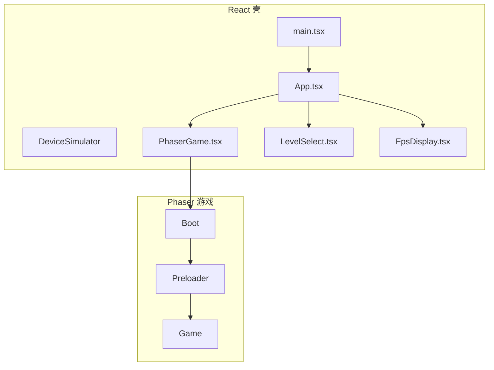
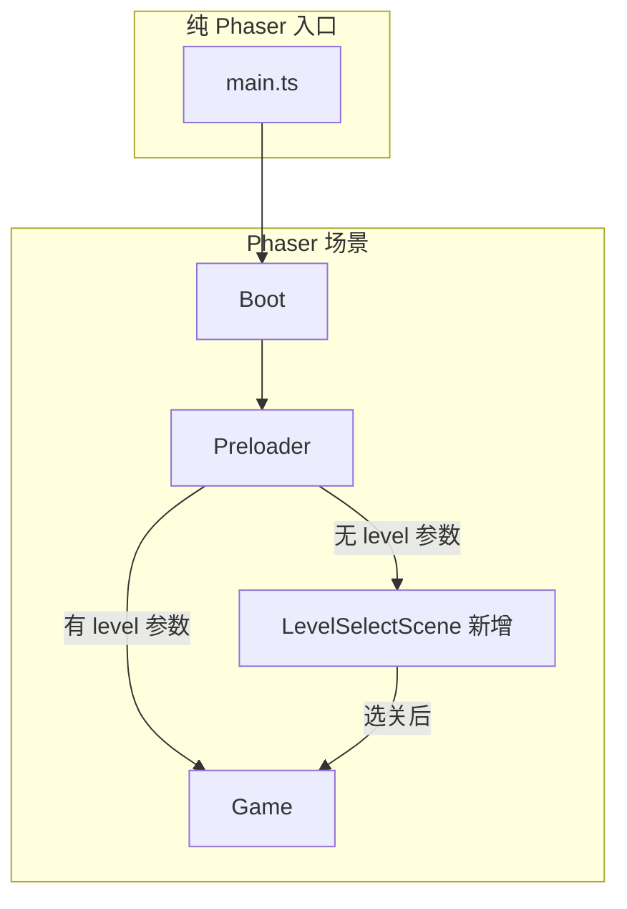

# phaser-cv-demo 纯 Phaser 迁移计划

## 当前架构




- **main.tsx**: 加载 config、pregenerate 谜题 → `ReactDOM.createRoot` 渲染 App
- **App.tsx**: 背景图、`PhaserGame`、`LevelSelect`（无 `?level=` 时）、`FpsDisplay`
- **DeviceSimulator**: 开发模式下包裹 iframe + ConstantsEditor + 工具栏
- **PhaserGame**: React 组件，在 `#game-container` 内创建 Phaser 实例

## 目标架构




---

## CV API 必须遵守的原则

迁移过程中**不得破坏**以下 CV 相关配置与实现，否则 `?cv=1` 截帧将失效：

### Phaser 配置（game/main.ts）

- `preserveDrawingBuffer: true` — 缺失则 `toDataURL` 黑屏
- `CvAutoInitPlugin` 已注册于 `plugins.scene`
- `type: WEBGL`

### Game 场景

- 保留 `getCvAdapter()` 实现，返回 `getRootRenderable`、`getStaticTintables`、`getStaticCvIds`/`getColorMapIds`
- 保留 `captureColorCodedFrame`（由 CvIntegration 挂载）
- `CVBridge.captureColorCodedFrame` 依赖 `game.scene.getScene('Game')`，Game 场景必须存在且为主游戏场景

### Board / Tube / Ball

- Board：`prepareCvRender`、`getCvChildren`、`getColorCodeObjectIds` 保持不变
- Tube：`prepareCvRender` 保持不变
- Ball：`getCvTintables`、`ICvTintableProvider` 保持不变

### LevelSelectScene 与 CV

- LevelSelectScene **不实现** CV 接口，不参与截帧
- CV 仅在进入 Game 场景后生效

### 迁移后验证

- 运行 `npm run cv:check`，须输出 `4/4 核心项通过`
- 访问 `?cv=1`，控制台须输出 `[CV] 接入检查: 4/4 ✓ 接入完整`
- 按 S 键截帧，CV UI (localhost:5000) 能收到并显示

---

## 实施步骤

### 1. 新增 LevelSelectScene（Phaser 选关场景）

在 [src/game/scenes/](packages/phaser-cv-demo/src/game/scenes/) 下新建 `LevelSelectScene.ts`，用 Phaser 实现原 `LevelSelect.tsx` 的 UI：

- **布局**：左侧 logo + 标题，右侧 3 个选关按钮 + 手指引导动画
- **资源**：复用 Preloader 已加载的 `icon`、`choose.png`、`play-now.png`、`手.png`、`tube`、`ball` 等

**关卡预览（直接绘制 3 关）**：

- 每个选关按钮 = `Container`（边框 + 预览内容）
- 预览内容：用 `getCachedPuzzle(difficulty, emptyTubeCount)` 或 `generatePuzzleWithAdapter` 获取谜题，在按钮内用 Phaser 直接绘制
  - 方案 A：用 `Graphics` 画矩形块表示液体（`getLiquidColors()` 取颜色），叠加试管 `Image` 做遮罩
  - 方案 B：用 scaled 的 `tube`、`ball` 精灵按谜题布局绘制（与游戏风格一致）
- 3 个按钮分别对应难度 1、5、9，每个按钮内显示该难度的真实预览

**放大缩小动画**：

- 每个按钮容器设置 `setInteractive`，支持 hover/click
- 悬停时：`this.tweens.add({ targets: card, scaleX: 1.08, scaleY: 1.08, duration: 200, ease: 'Power2' })`
- 悬停离开：`scaleX: 1, scaleY: 1`
- 可选：空闲时对当前卡片做轻微呼吸动画（`scale 1.05 ↔ 1`，yoyo 循环），吸引注意力

**交互**：点击后 `setPersistentSelectedLevel(difficulty)`、`EventBus.emit('level-selected')`，然后 `this.scene.start('Game', { difficulty, ... })`

- **PLAY NOW**：调用 `download()`（来自 [download.ts](packages/phaser-cv-demo/src/game/scenes/constants/download.ts)）
- **手指动画**：用 `Tween` 实现原 `runCycle` 的移动→等待→点击循环

### 2. 修改 Preloader 场景

在 [Preloader.ts](packages/phaser-cv-demo/src/game/scenes/Preloader.ts) 中：

- 加载 LevelSelectScene 所需资源（若尚未在 Preloader 中加载）
- 根据 `getInitialLevelFromURL()` 决定启动场景：
  - 有 `?level=1|2|3`：直接 `this.scene.start('Game', puzzleData)`
  - 无参数：`this.scene.start('LevelSelectScene')`

### 3. 修改 main.ts 入口

新建 [src/main.ts](packages/phaser-cv-demo/src/main.ts)（替代 main.tsx）：

```ts
async function bootstrap() {
  const config = await fetchGameConstants();
  initGameConstants(config);
  const { pregeneratePuzzles } = await import('./utils/puzzleCache');
  pregeneratePuzzles();
  Start(); // viewable-handler
  const StartGame = (await import('./game/main')).default;
  StartGame('game-container');
}
bootstrap();
```

- 保留 config 加载、pregenerate、`Start()`（mraid）
- 直接调用 `StartGame('game-container')`，不再使用 React

### 4. 修改 index.html

在 [index.html](packages/phaser-cv-demo/index.html) 中：

- 将 `<script src="/src/main.tsx">` 改为 `<script src="/src/main.ts">`
- 保留 `<div id="game-container">`（或改为 body 直接挂载）
- 移除 `<div id="root">`（不再需要 React 挂载点）

### 5. 修改 game/main.ts 配置

在 [game/main.ts](packages/phaser-cv-demo/src/game/main.ts) 的 `config.scene` 中：

- 加入 `LevelSelectScene`（在 Preloader 之后、Game 之前）
- **禁止修改**：`preserveDrawingBuffer: true`、`CvAutoInitPlugin` 注册（CV 必须）

### 6. 背景与 FPS

- **背景**：在 Boot 或 LevelSelectScene 的 `create` 中根据 `window.innerHeight > innerWidth` 选择 `bgV`/`bgH`，设置 `this.cameras.main.setBackgroundColor` 或全屏 `Image`
- **FPS**：开发模式下在 LevelSelectScene 或 Game 中加一个 `Text` 对象，用 `this.time.addEvent` 每秒更新；或使用 Phaser 的 `this.add.text(0,0,'').setScrollFactor(0)` + 手动 `requestAnimationFrame` 计算 FPS

### 7. 移除 React 相关

- 删除：`App.tsx`、`PhaserGame.tsx`、`LevelSelect.tsx`、`LevelPreview.tsx`、`FpsDisplay.tsx`、`DeviceSimulator.tsx`、`ConstantsEditor.tsx`、`sound.tsx`、`main.tsx`
- 删除：`DeviceSimulator.css`、`LevelSelect.css`、`LevelPreview.css`、`ConstantsEditor.css`
- 从 [package.json](packages/phaser-cv-demo/package.json) 移除：`react`、`react-dom`、`@vitejs/plugin-react`、`@types/react`、`@types/react-dom`、`eslint-plugin-react-hooks`、`eslint-plugin-react-refresh`
- 从 [vite/config.dev.mjs](packages/phaser-cv-demo/vite/config.dev.mjs) 和 [vite/config.prod.mjs](packages/phaser-cv-demo/vite/config.prod.mjs) 移除 `react()` 插件

### 8. DeviceSimulator 与 ConstantsEditor 处理

- **DeviceSimulator**：移除。开发时可直接用 `?simulator=1` 打开全屏或新窗口（若需保留，可做成独立 HTML 页面，用 iframe 加载游戏，不依赖 React）
- **ConstantsEditor**：主应用内不再使用。开发时使用 `npm run dev-tools` 的 [http://localhost:3001](http://localhost:3001) 页面（纯 HTML + 原生 JS，已存在）

### 9. 精简 index.css

- 保留 `#game-container`、`canvas` 相关样式
- 移除 `#app`、`.level-select-container`、`.level-select-visible` 等 React 布局样式

### 10. 验证与回归

- `?level=1`、`?level=2`、`?level=3` 直接进入 Game
- 无参数时进入 LevelSelectScene，选关后进入 Game
- 背景、手指引导、FPS（DEV）、viewable-handler、EventBus 事件流正常
- `npm run build` 能成功生成单文件
- **CV 验证**：`npm run cv:check` 通过；`?cv=1` 进入 Game 后按 S 截帧，CV UI 正常显示

---

## 关键文件引用


| 功能    | 原实现                                                                         | 迁移后                                            |
| ----- | --------------------------------------------------------------------------- | ---------------------------------------------- |
| 入口    | [main.tsx](packages/phaser-cv-demo/src/main.tsx)                            | [main.ts](packages/phaser-cv-demo/src/main.ts) |
| 选关 UI | [LevelSelect.tsx](packages/phaser-cv-demo/src/components/LevelSelect.tsx)   | LevelSelectScene.ts                            |
| 关卡预览  | [LevelPreview.tsx](packages/phaser-cv-demo/src/components/LevelPreview.tsx) | LevelSelectScene 内直接绘制 3 关 + 按钮缩放动画            |
| 背景    | App.tsx `backgroundImage`                                                   | Boot/LevelSelectScene `create`                 |
| FPS   | [FpsDisplay.tsx](packages/phaser-cv-demo/src/components/FpsDisplay.tsx)     | Phaser Text + 定时更新                             |
| 场景流程  | Preloader → Game                                                            | Preloader → LevelSelectScene 或 Game            |


---

## 风险与注意点

1. **关卡预览绘制**：用 Phaser `Graphics` 画液体块或 scaled 精灵均可，可抽 `drawLevelPreview(scene, puzzle, x, y, scale)` 工具函数复用
2. **手指动画时序**：原 `runCycle` 含 `moveDuration`、`waitAfterMove`、`tapDuration`、`idleDuration`，需在 LevelSelectScene 中用 `Tween` + `delayedCall` 复现
3. **Config 依赖**：LevelSelect 使用 `Config.UI_CONFIG?.LEVEL_SELECT`，需确保 Preloader 或 Boot 阶段已加载 config
4. **缩放动画**：`Container` 的 `scale` 会影响子对象，确保预览内容在容器内居中
5. **CV 兼容**：不得修改 Game 的 `getCvAdapter`、Board/Tube/Ball 的 CV 接口；不得移除 `preserveDrawingBuffer` 或 `CvAutoInitPlugin`；否则 `?cv=1` 截帧失效

