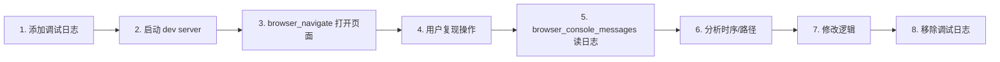

# 复现问题调试计划

本文档描述通过「加日志 → Cursor 内置浏览器复现 → 读控制台 → 分析 → 修复」的通用调试流程，适用于难以直接定位的交互或时序类问题。

---

## 一、通用流程



---

## 二、添加日志的约定

### 2.1 统一前缀

为便于过滤，使用统一前缀，例如：

- `[HAND]` 引导手指相关
- `[ConstantsEditor]` 数值编辑相关
- `[DeviceSimulator]` 模拟器相关
- `[Board]` 棋盘逻辑相关

### 2.2 日志内容建议

| 位置 | 建议包含 |
|------|----------|
| 函数入口 | 关键参数、调用时机 `t=${performance.now()}` |
| 分支条件 | 条件值、走的分支 |
| 事件触发 | 事件名、来源、时间戳 |
| 异步回调 | 回调触发时机、相关状态 |

### 2.3 示例

```javascript
// 定时器调度
console.log('[HAND] 初始引导定时器已调度 delay=1500ms t=${performance.now()}');

// 事件处理
console.log('[HAND] handleTubeClick tubeId=${tube.id} initialHintTimer存在=${!!this.initialHintTimer} t=${performance.now()}');

// 保存成功
console.log('[ConstantsEditor] save success, dispatching constants-saved');
```

---

## 三、操作步骤

### 3.1 前置条件

- 运行 `npm run dev`（或 `npm run dev:demo`）
- 确保 dev-tools 已启动（若涉及数值编辑）

### 3.2 使用 Cursor 内置浏览器

1. **browser_navigate** 到目标页面，例如：
   - `http://localhost:8080` 游戏主页面
   - `http://localhost:8080?enableSimulator=1` 带模拟器
   - `http://localhost:8080?level=1` 直接进入关卡

2. **browser_snapshot** 获取页面结构（需要点击时）

3. **用户操作**：按问题场景复现（点击、输入、等待等）

4. **browser_console_messages** 获取控制台输出

5. 根据日志分析执行路径和时序

---

## 四、常见问题与排查方向

| 现象 | 可能原因 | 排查方向 |
|------|----------|----------|
| 定时器触发时机不对 | 计时起点错误（如从创建开始而非可见开始） | 改为在「用户可见」时再启动定时器 |
| 事件未到达 | 监听未注册、条件未满足 | 检查 useEffect 依赖、showSimulator 等 |
| 整页刷新而非局部更新 | Vite 监听到文件变更触发 HMR | 在 `vite.config` 的 `watch.ignored` 中排除该文件 |
| 配置未生效 | 模块缓存、JSON 未重新加载 | 检查 configLoader 是否从 `/api/constants` 获取，或 touch 相关模块 |
| ref 为 null | 渲染顺序、条件渲染 | 确认 ref 绑定与挂载时机 |

---

## 五、实施步骤 checklist

- [ ] 确定问题场景和预期行为
- [ ] 在相关逻辑中插入带前缀的 `console.log`
- [ ] 启动 dev server
- [ ] 用 Cursor 浏览器打开页面并复现
- [ ] 调用 `browser_console_messages` 获取日志
- [ ] 根据日志分析根因
- [ ] 修改逻辑并验证
- [ ] 移除所有调试日志

---

## 六、参考案例

- **引导手指**：Board 创建过早，1.5 秒从创建开始算 → 改为监听 `game-visible` 事件后再启动
- **数值编辑热更新**：保存后整页刷新 → 在 Vite `watch.ignored` 中排除 `game-constants-config.json`
- **配置不生效**：Vite 模块缓存 → 保存后 touch `GameConstants.ts` 或改为运行时从 `/api/constants` 获取
